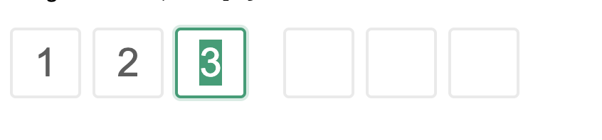

## later-security-code
Security Code Component for React

## 📦 Installation
```sh
npm i later-security-code
```

## 🔨 Usage
```tsx
import { SecurityCode } from 'later-security-code';

export default () => (
  <SecurityCode
    onCodeChanged={() => {
      console.log('onCodeChanged...')
    }}
    onCodeEntered={e => {
      console.log('onCodeEntered...', e)
    }}
    fields={6} />
)
```

## 🖥 Browser compatibility

- Modern browsers and Internet Explorer 11 (with [polyfills](https://stackoverflow.com/questions/57020976/polyfills-in-2019-for-ie11))
- [Electron](https://www.electronjs.org/)

| [](http://godban.github.io/browsers-support-badges/) | [](http://godban.github.io/browsers-support-badges/) | [](http://godban.github.io/browsers-support-badges/) | [](http://godban.github.io/browsers-support-badges/) | [](http://godban.github.io/browsers-support-badges/) |
| --- | --- | --- | --- | --- |
| IE11, Edge | last 2 versions | last 2 versions | last 2 versions | last 2 versions |


## SNAPSHOT


## LICENSE
MIT
